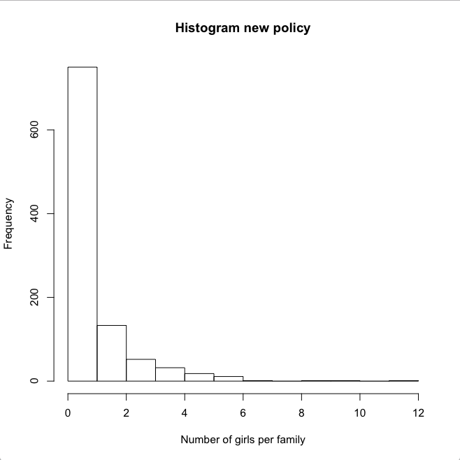

# Exercise 3: a novel child policy

Once upon a time there was a big country in which families had the right and obligation to get only one child each. If it's a boy the family is happy, if it's a girl, it is sad. Obviously, the expected fraction of girls, and thus also the expected fraction of sad families, is 1/2. Therefore, the government considers to change the law and give each family the right and obligation to get exactly one boy. This should result in 100% happy families. However, families can grow much larger under the new policy as the minimum number of girls per family is zero, while there is no theoretical maximum.

You, as a prominent member of a policy institute, are responsible for predicting the impact of this new policy on the fraction girls, a number between zero and one. **Task-0: what is your gut feeling?**

The following _recursive function_ `n_girls()` should simulate the number of girls for just one random family. **Task-1: please make it work!**



```r
# The function n_girls simulates the children of a random family
# and returns the number of girls.
n_girls <- function() {
  is_boy <- .5 < runif(1)
  if (is_boy)
    return("Base case")
  else
    return("Recursion")
}
```



Because `runif(1)` returns a random number from a uniform distribution between zero and one. Because this number is expected to be larger than 0.5 in 50% of the cases, the Boolean `is_boy` is `TRUE` in 50% of the cases and `FALSE` in the other 50% of the cases.

```r
n_girls <- function() {
  is_boy <- .5 < runif(1) # is TRUE in 50% of the cases
  if (is_boy)
    return(0) # Once a boy is born, zero girls will be born
  else
    return(1 + "remaining girls") # Put recursive call here
}
```

_Recursive case:_ in case the Boolean `is_boy` is `FALSE`, a girl is born. However, more children will be born. Although the total number of girls is unknown at this moment, you can state that the total number of girls is one plus the number of girls that will follow.



The following function `n_girls_per_fam` returns a vector of size `n_fam` with  the number of girls per family. Let's run it and create a histogram of the numbers of girls per family:

```r
# Returns a vector with the simulated number of girls per family
n_girls_per_fam <- function(n_fam) {
    vec <- NULL
    for (i in 1:n_fam)
        vec[i] <- n_girls()
    return(vec)
}

n_fam <- 1000 # Let's assume 1000 families

fam_vec <- n_girls_per_fam(n_fam)

hist(fam_vec, main = "Histogram new policy", xlab = "Number of girls per family")
```





**Task-2: what is the fraction of girls in this simulation?**

```r
fraction_girls <- function(fam_vec) {
  n_boys <- "Task-2a"
  n_girls <- "Task-2b"
  
  fraction <- "Task-2c"
  return(fraction)
}
```



First inspect the vector `vec`. Remember that the vector represents the number of girls per family. Each position in the vector is a family: `vec[i]` is the number of girls in family `i`.

```r
fraction_girls <- function(fam_vec) {
  n_boys  <- length(fam_vec) # Each family gets one boy
  n_girls <- sum(fam_vec)    # Get the total number of girls
  
  fraction <- "Task-2c"
  return(fraction)
}
```

Can you derive fraction of girls from the two variables `n_boys` and `n_girls`?



By running the function call `fraction_girls(fam_vec)`you get the fraction of girls in our single simulation of 1000 families. This already gives you an indication of the expected fraction of girls: see Task-0 above. **Is it in line with your gut feeling?**

As a prominent member of a policy institute, you of course first want to do a serious simulation, before drawing definitive conclusions. Let's run 100 simulations and test whether the mean of the observed distribution of fractions is significantly different from the ratio of `1/2` in the current policy.

```r
n_sim <- 100

fg <- NULL
for (i in 1:n_sim) {
    vec <- n_girls_per_fam(n_fam)
    fg[i] <- fraction_girls(vec)
}
```

Let's make a histogram and mark `1/2`:

```r
# Histogram of simulated distribution of fraction
hist(fg, main = "Histogram new policy",
           xlab = "Fraction of girls", xlim = c(0, 1))
abline(v = 1/2, col = "orange", lwd = 2)
```

## **Conclusion**

You have simulated 100 times 1000 families getting children under the new policy and visualised the observed distribution of the resulting 100 fraction of girls. Now it's time to statistically test whether the mean of the observed distribution of the fraction is different from the well-known fraction of 1/2 under the current policy.

```r
# Can you assume normality? 
t.test(x = fg, mu = 1/2)$p.value
```

**Task-3: so, what do you report to your government on the impact of the new policy on the fraction of girls?**

